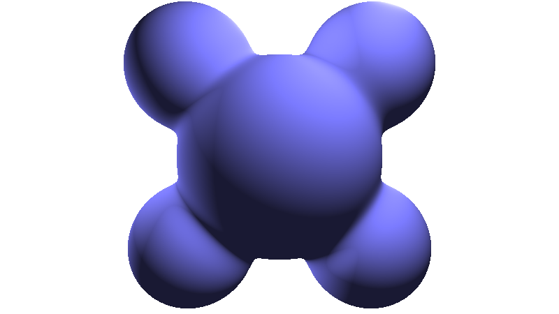

# Lighting models

All the lighting models described on this page use the following notation, 
as illustrated in the image below.

<figure>
    
    <caption>Source &mdash; Wikipedia</caption>
</figure>

Let $P$ be the point on the surface, then:

 * $\mathbf{N}$ is the normal vector of the surface at $\mathbf{P\mathbf{$.
 * $\mathbf{L}$ is the vector from $\mathbf{P}$ to the light source.
 * $\mathbf{V}$ is the vector from $\mathbf{P}$ to the camera (eye).
 * $\mathbf{H}$ is the halfway vector between $\mathbf{L}$ and $\mathbf{V}$.
 * $\mathbf{R}$ is the reflected vector $\mathbf{V}$ around $\mathbf{N}$.

To find the reflection vector, we can use $\mathbf{R} = \mathbf{V} - 2(\mathbf{V}\cdot\mathbf{N})\mathbf{N}$, where $\mathbf{V}\cdot\mathbf{N}$ is a dot-product.

To find the halfway vector, we can use $\mathbf{H} = \dfrac{\mathbf{L}+\mathbf{V}}{||\ \mathbf{L}+\mathbf{V}\ ||}$.

!!! attention
    Note that all of these vectors must be normalized, which is often denoted with a hat, like $\mathbf{\hat{N}}$.

## Lambertian

[Lambertian reflectance](https://en.wikipedia.org/wiki/Lambertian_reflectance) looks like an ideal "matte" or diffuse reflecting material. 
It is based on the angle between the light $\mathbf{L}$ and the surface normal $\mathbf{N}$:

$$
I_D = \mathbf{L}\cdot\mathbf{N}CI_L
$$

where 

<figure>
    
</figure>

```glsl
float brdf_lambertian(vec3 N, vec3 L) {
    float k = clamp(dot(N, L), 0., 1.);
    return k;
}
```

## Lambertian (wrapped)

Wrapping the light can be used to fake subsurface scattering or area light. 
A parameter `wrap` is used which is a value between $[0, 1]$.

<figure>
    
</figure>

```glsl
float brdf_lambertian_wrapped(vec3 N, vec3 L) {
    float wrap = 0.5;
    float k = max(0., (dot(L, N) + wrap) / (1. + wrap));
    return k;
}
```

## Phong

<figure>
    
</figure>

```glsl
float brdf_phong(vec3 R, vec3 V, float exponent) {
    float k = pow(max(0., dot(R,V)), exponent);
    return k;
}
```

## Blinn-Phong

TBA

## Gaussian

<figure>
    
</figure>

```glsl
float brdf_gaussian(vec3 N, vec3 H, float m) {
    float NHm = angle(N,H) / m;
    float NHm2 = NHm*NHm;
    float k = exp(-NHm2);
    return k;
}
```

## Beckmann

<figure>
    
</figure>

```glsl
float brdf_beckmann(vec3 N, vec3 H, float m) {
    float NdotH = dot(N, H);
    float tana = length(cross(N, H)) / NdotH;
    float cosa = NdotH;
    float m2 = m*m;
    float tana2 = tana*tana;
    float cosa4 = pow(abs(cosa), 4.);
    float k = exp(-tana2 / m2) / (3.14159 * m2 * cosa4);
    return k;
}
```

## GGX

The GGX lighting model is a microfacet model for refracting through rough surfaces. It is also a model that is becoming popular for lighting in video games. [1] The GGX lighting model is [derived in this paper](http://www.cs.cornell.edu/~srm/publications/EGSR07-btdf.pdf).


<figure>
    
</figure>

```glsl
float G1V(float dotNV, float k) {
    return 1.0 / (dotNV * (1.0 - k) + k);
}

float brdf_ggx(vec3 N, vec3 V, vec3 L, float roughness, float F0) {
    float alpha = roughness * roughness;
    vec3 H = normalize(V+L);
    float dotNL = clamp(dot(N,L), 0., 1.);
    float dotNV = clamp(dot(N,V), 0., 1.);
    float dotNH = clamp(dot(N,H), 0., 1.);
    float dotLH = clamp(dot(L,H), 0., 1.);
    float alphaSqr = alpha*alpha;
    float pi = 3.14159;
    float denom = dotNH * dotNH * (alphaSqr - 1.0) + 1.0;
    float D = alphaSqr / (pi * denom * denom);
    float dotLH5 = pow(1.0 - dotLH, 5.0);
    float F = F0 + (1.0 - F0) * dotLH5;
    float k = alpha / 2.0;
    float vis = G1V(dotNL, k) * G1V(dotNV, k);
    return dotNL * D * F * vis;
}
```

Author: John Hable

# Further Reading

optimizing-ggx-shaders-with-dotlh/).
* [Physically Based Lighting at Pixar](https://blog.selfshadow.com/publications/s2013-shading-course/pixar/s2013_pbs_pixar_notes.pdf).
* [Physically Based Shading at Disney](https://neil3d.github.io/assets/pdf/s2012_pbs_disney_brdf_notes_v3.pdf).
* [Real Shading in Unreal Engine 4](https://blog.selfshadow.com/publications/s2013-shading-course/karis/s2013_pbs_epic_notes_v2.pdf).

# References

* [1] [Optimizing GGX Shaders with dot(L,H)](http://filmicworlds.com/blog/